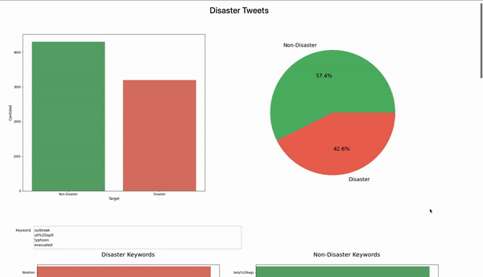

# Dashboard Disaster Tweets


### Clonar repositorio
```` 
git clone git@github.com:UVG-Teams/dashboard-disaster-tweets.git
````

### Instalar Voilà
```` 
pip3 install voila
````

### Ejecutar
```` 
voila main.ipynb
````


## Demo
<p align="center">  
    
</p>

